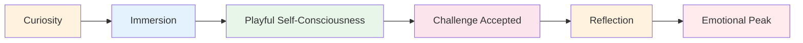
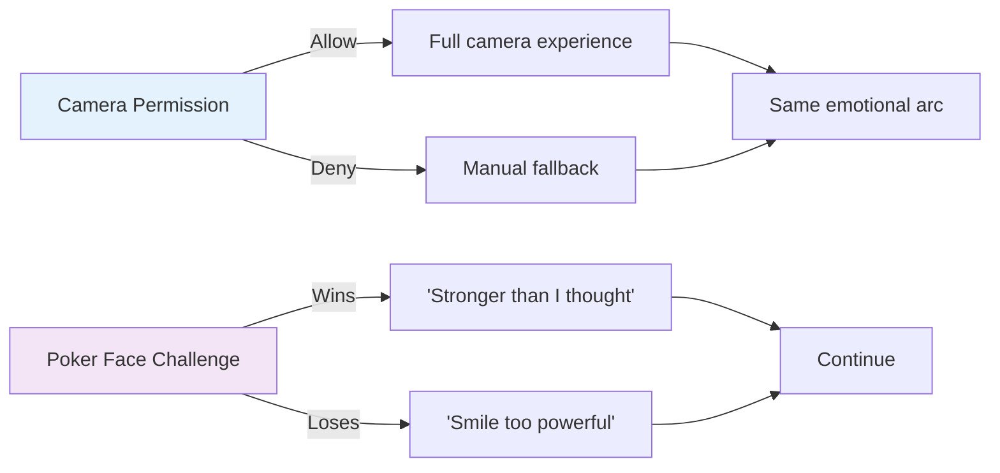

# User Journey Map - Smile Diner

## Visual Flow Diagram

```mermaid
flowchart TD
    Start([She opens the link]) --> Title[Scene 0: Title Screen<br/>🎨 Hand-drawn title + character<br/>💭 'What is this cute thing?']
    
    Title -->|Tap to start| Kitchen[Scene 1: Empty Kitchen<br/>🏠 Cozy kitchen background<br/>💭 'This is a little world']
    
    Kitchen -->|Tap stove| StoveAnim[Stove wakes up<br/>'Missing something...']
    StoveAnim -->|Continue| SmileStage{Scene 2: Smile Charge<br/>📷 Camera permission?}
    
    SmileStage -->|Allow| CameraMode[Camera Mode<br/>👤 Face preview<br/>💧 Jar filling with smile<br/>💭 'My smile powers this!']
    SmileStage -->|Skip| ManualMode[Manual Mode<br/>🔘 Hold to charge button<br/>💧 Same jar visual]
    
    CameraMode -->|8-12s smiling| JarFull[✨ Jar full!<br/>Celebration animation]
    ManualMode -->|Hold long enough| JarFull
    
    JarFull -->|Continue| PokerStage{Scene 3: Poker Face<br/>📷 Camera available?}
    
    PokerStage -->|Yes| PokerCamera[Camera Mode<br/>😐 Keep composure meter full<br/>🎭 Teasing prompts appear<br/>💭 'He knows I'll fail!']
    PokerStage -->|No| PokerManual[Manual Mode<br/>🔘 'Don't tap' button<br/>🎭 Same teasing prompts]
    
    PokerCamera -->|Smiles detected| Penalty[💔 Meter drains<br/>😆 Goofy photo penalty]
    Penalty -->|Keep trying| PokerCamera
    PokerManual -->|Taps button| Penalty
    Penalty -->|Keep trying| PokerManual
    
    PokerCamera -->|18-25s survived| Success[✅ Success or<br/>😊 Playful fail]
    PokerManual -->|18-25s survived| Success
    
    Success -->|Continue| Assembly[Scene 4: Dish Assembly<br/>🍽️ Plate + ingredient tokens<br/>💭 'These are our vibes']
    
    Assembly -->|Tap ingredients| AddIng[Add Warmth<br/>Add Composure<br/>...]
    AddIng -->|All added| DishComplete[✨ Dish complete!<br/>Visual upgrade]
    
    DishComplete -->|Continue| Final[Scene 5: Final Reveal<br/>💌 'Missing ingredient is YOU'<br/>💭 Emotional click]
    
    Final -->|Chase 'no' button| Playful[😄 Laughs]
    Playful -->|Tap 'Yes'| End([💕 Valentine Accepted<br/>Warm closing])
    
    style Start fill:#ffebee
    style Title fill:#fff3e0
    style Kitchen fill:#fff3e0
    style SmileStage fill:#e3f2fd
    style CameraMode fill:#e8f5e9
    style ManualMode fill:#e8f5e9
    style JarFull fill:#fff9c4
    style PokerStage fill:#f3e5f5
    style PokerCamera fill:#fce4ec
    style PokerManual fill:#fce4ec
    style Penalty fill:#ffcdd2
    style Success fill:#c8e6c9
    style Assembly fill:#fff3e0
    style Final fill:#ffebee
    style End fill:#c8e6c9
```

## Emotional Arc

```mermaid
graph LR
    A[Curiosity] --> B[Immersion]
    B --> C[Playful Self-Consciousness]
    C --> D[Challenge Accepted]
    D --> E[Reflection]
    E --> F[Emotional Peak]
    
    style A fill:#fff3e0
    style B fill:#e3f2fd
    style C fill:#e8f5e9
    style D fill:#fce4ec
    style E fill:#fff3e0
    style F fill:#ffebee
```

## Decision Points & Branches

```mermaid
flowchart LR
    A[Camera Permission] -->|Allow| B[Full camera experience]
    A -->|Deny| C[Manual fallback]
    B --> D[Same emotional arc]
    C --> D
    
    E[Poker Face Challenge] -->|Wins| F['Stronger than I thought']
    E -->|Loses| G['Smile too powerful']
    F --> H[Continue]
    G --> H
    
    style A fill:#e3f2fd
    style E fill:#f3e5f5
```
