# User Journey Map – Don Kitchen · Mai as Our Cherished Customer

## Concept

A **fully immersive, game-like experience** that welcomes **Mai** as the cherished customer of Don Kitchen. Through playful games and interactions, we show Mai the qualities that make Don Kitchen special. The experience culminates in the ask: **Will Mai continue to be our finest, most lovable customer of Don Kitchen?**

---

## Visual Flow Diagram

```mermaid
flowchart TD
    Start([Mai opens the link]) --> Title[Scene 0: Welcome<br/>🎨 Hand-drawn title + Don Kitchen<br/>💭 'They're welcoming me!']
    
    Title -->|Tap to start| Kitchen[Scene 1: Empty Kitchen<br/>🏠 Cozy kitchen background<br/>💭 'This is their world – for me']
    
    Kitchen -->|Tap stove| StoveAnim[Stove wakes up<br/>'We've been waiting for you...']
    StoveAnim -->|Continue| SmileStage{Scene 2: Smile Charge · Warmth<br/>📷 Camera permission?}
    
    SmileStage -->|Allow| CameraMode[Camera Mode<br/>👤 Face preview<br/>💧 Jar filling with smile<br/>💭 'My smile fills their warmth']
    SmileStage -->|Skip| ManualMode[Manual Mode<br/>🔘 Hold to charge button<br/>💧 Same jar visual]
    
    CameraMode -->|8-12s smiling| JarFull[✨ Jar full!<br/>Celebration · Don Kitchen warmth]
    ManualMode -->|Hold long enough| JarFull
    
    JarFull -->|Continue| PokerStage{Scene 3: Poker Face · Composure<br/>📷 Camera available?}
    
    PokerStage -->|Yes| PokerCamera[Camera Mode<br/>😐 Keep composure meter full<br/>🎭 Teasing prompts appear<br/>💭 'They know I'll crack!']
    PokerStage -->|No| PokerManual[Manual Mode<br/>🔘 'Don't tap' button<br/>🎭 Same teasing prompts]
    
    PokerCamera -->|Smiles detected| Penalty[💔 Meter drains<br/>😆 Playful penalty]
    Penalty -->|Keep trying| PokerCamera
    PokerManual -->|Taps button| Penalty
    Penalty -->|Keep trying| PokerManual
    
    PokerCamera -->|18-25s survived| Success[✅ Success or<br/>😊 Playful fail]
    PokerManual -->|18-25s survived| Success
    
    Success -->|Continue| Assembly[Scene 4: Qualities Assembly<br/>🍽️ Plate + quality tokens<br/>💭 'These are what Don Kitchen brings']
    
    Assembly -->|Tap qualities| AddQ[Add Warmth<br/>Add Composure<br/>...]
    AddQ -->|All added| Complete[✨ Complete!<br/>Visual upgrade]
    
    Complete -->|Continue| Final[Scene 5: Final Reveal<br/>💌 'Will Mai continue to be our finest, most lovable customer?'<br/>💭 Emotional peak]
    
    Final -->|Chase 'no' button| Playful[😄 Laughs]
    Playful -->|Tap 'Yes'| End([💕 Yes – Mai stays our finest customer<br/>Warm closing])
    
    style Start fill:#ffebee
    style Title fill:#fff3e0
    style Kitchen fill:#fff3e0
    style SmileStage fill:#e3f2fd
    style CameraMode fill:#e8f5e9
    style ManualMode fill:#e8f5e9
    style JarFull fill:#fff9c4
    style PokerStage fill:#f3e5f5
    style PokerCamera fill:#fce4ec
    style PokerManual fill:#fce4ec
    style Penalty fill:#ffcdd2
    style Success fill:#c8e6c9
    style Assembly fill:#fff3e0
    style Final fill:#ffebee
    style End fill:#c8e6c9
```

## Emotional Arc

```mermaid
graph LR
    A[Welcomed] --> B[Curiosity]
    B --> C[Playful Engagement]
    C --> D[Don Kitchen Qualities Felt]
    D --> E[Reflection]
    E --> F[Emotional Peak – The Ask]
    
    style A fill:#fff3e0
    style B fill:#e3f2fd
    style C fill:#e8f5e9
    style D fill:#fce4ec
    style E fill:#fff3e0
    style F fill:#ffebee
```

## Don Kitchen Qualities (shown through the experience)

- **Warmth** – Smile Charge: we meet you with warmth; your smile fills our jar.
- **Composure** – Poker Face: we keep our cool (and love when you can’t).
- **Assembly** – We bring these qualities together for you, our cherished customer.

## Decision Points & Branches

## Final Ask

**Will Mai continue to be our finest, most lovable customer of Don Kitchen?**

- Primary CTA: **Yes** (Mai stays our finest customer).
- Playful secondary: **no** (dodges; can still lead to Yes / warm close).
